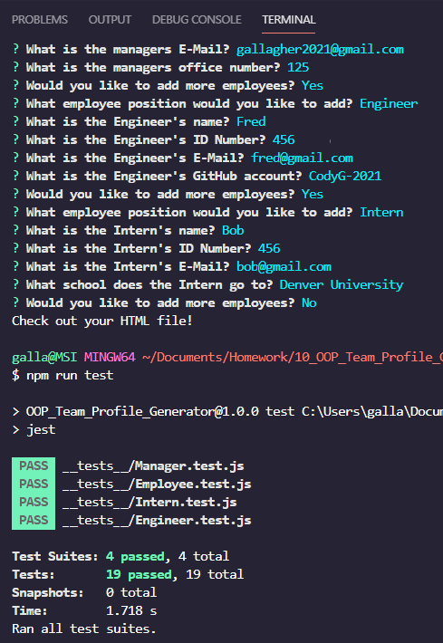

# Team Generator

## Description

Ask the user questions to generate a team page based on how many employees are entered. A html file will be sent to the dist folder of the application once all the questions have been answered and the user decides to not add any more employees. 

## Table of Contents
- [Description](#description)
- [Installation](#installation)
- [Usage](#usage)
- [License](#license)
- [Contributors](#contributors)
- [Tests](#tests)
- [Questions](#questions)
- [Contact](#contact)

## Installation

There are no files to download for this project

## Usage

Type node then index.js to start the inquirer.

Follow the questions to generate the cards on the html page.

For a full video demonstration [click here](https://drive.google.com/file/d/1lc4USeSBaSLVy70oTep13seOQDqoubk0/view?usp=sharing).

## License

Source link for [MIT](https://opensource.org/licenses/MIT)

## Contributors

Cody Gallagher

## Tests

Jest: ran by using npm run tests

There are 4 tests for each class of employee. 
Each test if the class methods are working.  

## Questions

Exporting can be a powerful tool, I'd like to learn more about the process. 

## Contact

[GitHub Profile](https://github.com/CodyG-2021)

Email Me -- gallagher2021@gmail.com
